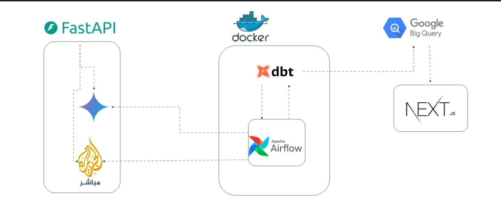
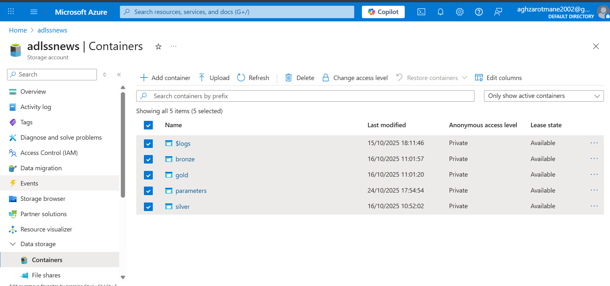
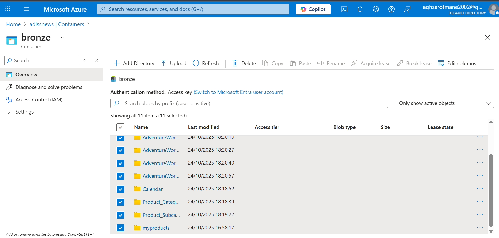
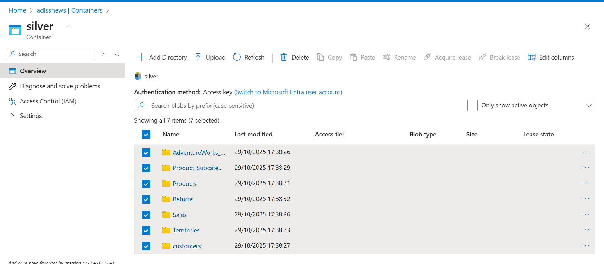
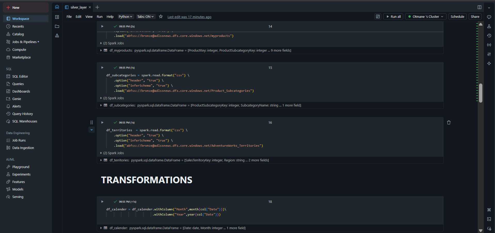
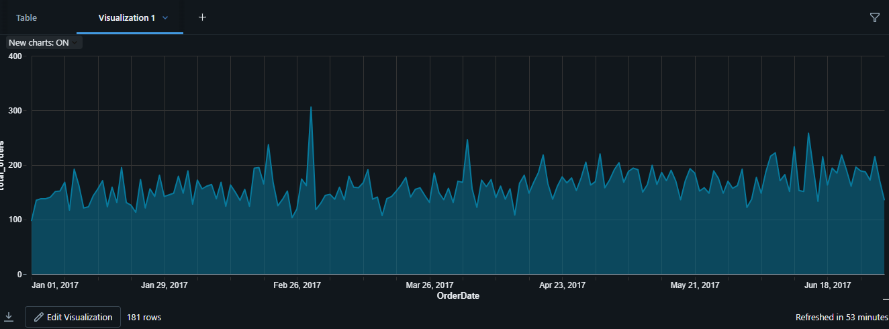
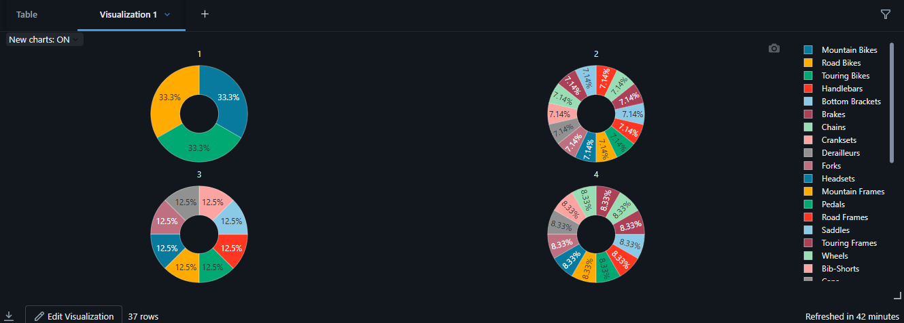
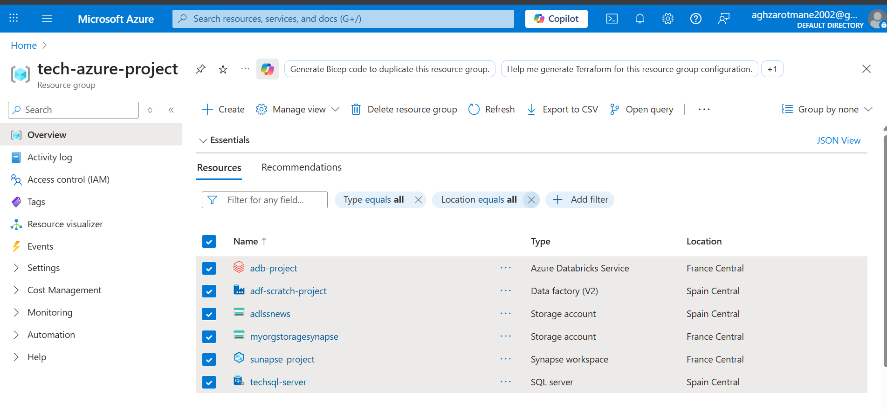
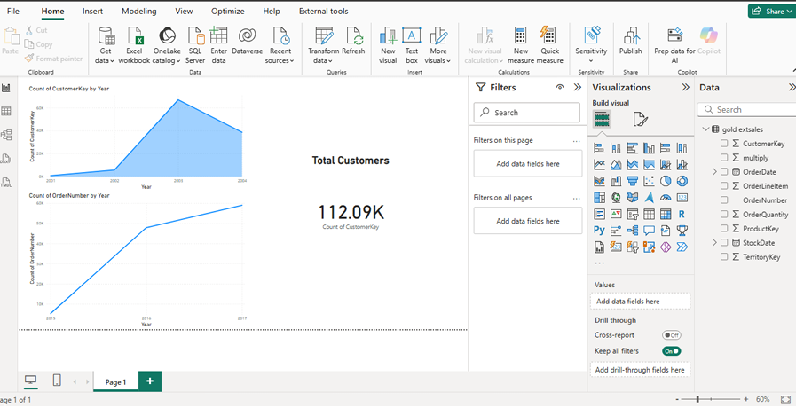
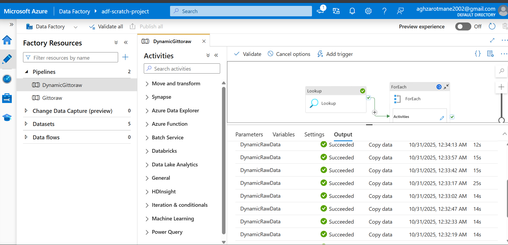

# Azure Data Engineering Pipeline Project 🚀

A comprehensive Data Engineering project leveraging Microsoft Azure services to build an end-to-end data pipeline, from ingestion to interactive visualization.

## 📋 Table of Contents
- [Overview](#overview)
- [Architecture](#architecture)
- [Project Structure](#project-structure)
- [Key Features](#key-features)
- [Technologies Used](#technologies-used)
- [Pipeline Workflow](#pipeline-workflow)
- [Data Layers](#data-layers)
- [Setup and Configuration](#setup-and-configuration)
- [Results and Outcomes](#results-and-outcomes)
- [Skills Demonstrated](#skills-demonstrated)

## 🎯 Overview

This project demonstrates a complete data engineering solution built on the Microsoft Azure cloud platform. It implements a modern data architecture following the Medallion architecture pattern (Bronze, Silver, Gold layers) to process, transform, and analyze data effectively.

## 🏗️ Architecture



### Pipeline Overview


The solution leverages multiple Azure services in an integrated architecture:

- **Data Source**: GitHub (CSV files repository)
- **Orchestration**: Azure Data Factory
- **Storage**: Azure Data Lake Storage Gen2
- **Processing**: Azure Databricks
- **Analytics**: Azure Synapse Analytics
- **Visualization**: Power BI

## 📁 Project Structure

```
project-azure/
├── Data/                           # Source data files
│   ├── AdventureWorks_Calendar.csv
│   ├── AdventureWorks_Customers.csv
│   └── ...
├── Reference Scripts/              # Reference implementation scripts
│   ├── Create Views Gold.sql
│   └── silver_layer_refer.ipynb
└── assets/                        # Project assets and documentation
```

## ✨ Key Features

- Automated data ingestion from GitHub
- Multi-layer data processing (Bronze → Silver → Gold)
- Distributed data processing with PySpark
- Advanced analytics with Synapse
- Interactive Power BI dashboards
- End-to-end pipeline orchestration
- Scalable and secure architecture

## 🛠️ Technologies Used

- **Azure Data Factory**
  - Pipeline orchestration
  - Data movement and transformation
  - Activity monitoring and logging

- **Azure Data Lake Storage Gen2**
  - Hierarchical namespace
  - Role-based access control (RBAC)
  - Optimized data lake organization

- **Azure Databricks**
  - PySpark processing
  - Delta Lake implementation
  - Notebook-based development

- **Azure Synapse Analytics**
  - SQL pools
  - Serverless queries
  - Data integration

- **Power BI**
  - Interactive dashboards
  - Real-time analytics
  - Custom visualizations

## 🔄 Pipeline Workflow

1. **Data Ingestion**
   
   - Automated extraction from GitHub repository
   - Landing in Bronze layer (raw data)
   - Metadata capture and validation

2. **Data Processing**
   
   - Data cleaning and standardization
   - Schema enforcement
   - Quality checks and validation
   - Transformation to Silver layer

3. **Data Modeling**
   - Business logic application
   - Aggregation and enrichment
   - Gold layer view creation
   - Performance optimization

4. **Data Analytics**
   - Integration with Synapse Analytics
   - Creation of analytical models
   - Implementation of business metrics
   - Performance monitoring

## 💎 Data Layers

### Bronze Layer (Raw)

- Raw data ingestion
- Source data preservation
- Audit logging
- Data versioning

### Silver Layer (Cleansed)

- Data validation
- Schema standardization
- Basic transformations
- Quality metrics

### Gold Layer (Business)

- Business aggregations
- Derived calculations
- Dimensional modeling
- Analytics-ready views

### Data Integration and Analytics



### Pipeline Monitoring


## 🔧 Setup and Configuration

1. **Prerequisites**
   - Azure subscription
   - Required Azure services enabled
   - Appropriate IAM roles and permissions

2. **Environment Setup**
   - Configure Azure Data Factory
   - Set up Data Lake Storage
   - Initialize Databricks workspace
   - Configure Synapse Analytics

3. **Pipeline Deployment**
   - Deploy ADF pipelines
   - Configure triggers
   - Set up monitoring
   - Implement error handling

## 📊 Results and Outcomes

- Successfully implemented end-to-end data pipeline
- Automated data processing workflow
- Scalable and maintainable architecture
- Real-time business analytics
- Improved data quality and reliability
- Enhanced decision-making capabilities

## 🎓 Skills Demonstrated

- **Cloud Architecture**
  - Azure services integration
  - Cloud-native design patterns
  - Security best practices

- **Data Engineering**
  - ETL/ELT pipeline development
  - Data modeling and transformation
  - Performance optimization

- **Programming & Tools**
  - PySpark
  - SQL
  - Python
  - Delta Lake
  - Git
